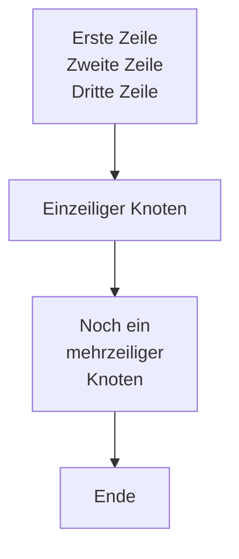
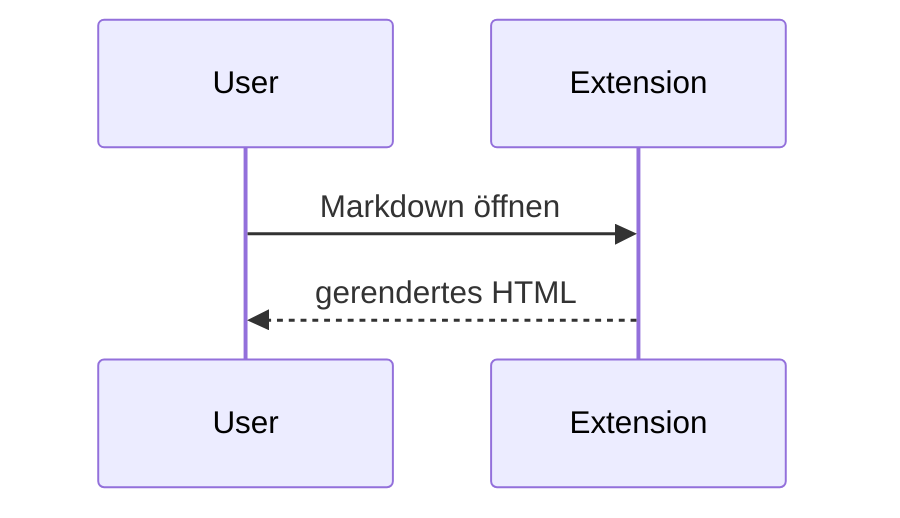

# Mermaid ` ` in Node-Labels — Test

> Feature: **content → „Mermaid diagrams"** muss **an** sein (PR #289).

**So testen:** In den Knoten unten stehen ` `-Umbrüche. Erwartung: Die Labels
werden **mehrzeilig** dargestellt (Zeilenumbruch sichtbar), nicht als eine lange
Zeile und nicht mit sichtbarem Text „\<br\>".

## Zweites Diagramm (Sequenz, zur Kontrolle)

---

**Hinweis:** Falls die ` `-Umbrüche im ersten Diagramm *nicht* greifen und die
Labels einzeilig bleiben, könnte dafür Mermaids `securityLevel: 'loose'` nötig
sein — das haben wir aus Sicherheitsgründen bewusst **nicht** übernommen (nur den
CSS-Fix). Dann müssten wir das separat abwägen.
